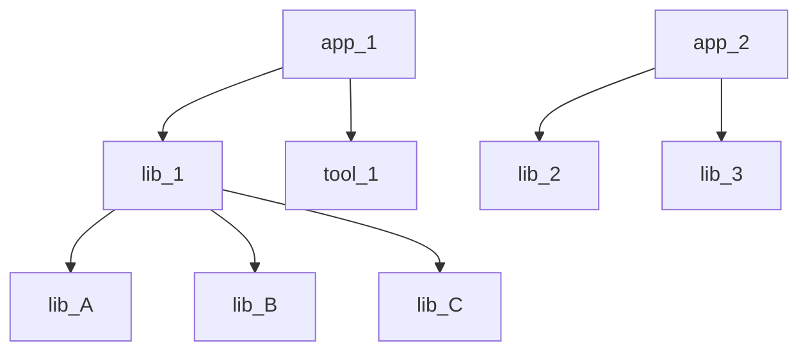

# changeset-releaser - a missing Atlassian Changesets companion tool

`changeset-releaser` allows you to test, build and run custom scripts in your monorepo incrementally, i.e. only for the packages that have changed and their dependencies and/or dependents.

## How it works

Let's assume you have already set up your monorepo according to the
[Atlassian Changesets documentation](https://www.npmjs.com/package/@changesets/cli).

Then you would want to setup your CI so that it would run `build` and `test` scripts only for relevant packages.

For example, if your monorepo dependency graph is the following:



### Example 1

And you have a changeset, that states that only `app_2` have changed, then perhaps, `changeset publish` willl publish only `app_2`. But in order to test `app_2` you would need to build all its dependencies, i.e. `lib_2` and `lib_3`.

So if you run `yarn changeset-releaser build`, the following packages will be built:

- `lib_2`
- `lib_3`
- `app_2`

Then you will need to test the changed packages. There is no need to test `lib_2` and `lib_3` as they have not changed. But `app_2` will need to be tested. So if you run `yarn changeset-releaser test`, the following packages will be tested:

- `app_2`

### Example 2

Let's assume that in your changeset, you have the information that `lib_B` has changed.

Then it should be built. But that's not all. Because it has changed, all its dependants should be tested for possible regression. That's why all its dependants (and all their dependencies) must be built prior to testing.

`changesets-releaser` takes this into account. So if you run `changesets-releaser build`, the following packages will be built:

- `lib_A`
- `lib_B`
- `lib_C`
- `lib_1`
- `tool_1`
- `app_1`

And then, if you run `changeset-releaser test`, the following packages will be tested:

- `lib_B`
- `lib_1`
- `app_1`

If you want to just lint the changed packages, you can run `changeset-releaser lint`. It will only lint the changed packages.

## Usage

Run `build` script incrementally:

```sh
changeset-releaser build
```

Run `test` script incrementally:

```sh
changeset-releaser test
```

Run lint script incrementally:

```sh
changeset-releaser lint
```

Run any script incrementally:

```sh
changeset-releaser <group> script
```

Where `group` is one of the following:

- `build` - run the script for those packages that would be built
- `test` - run the script for those packages that would be tested
- `changed` - run the script for those packages that have changed
